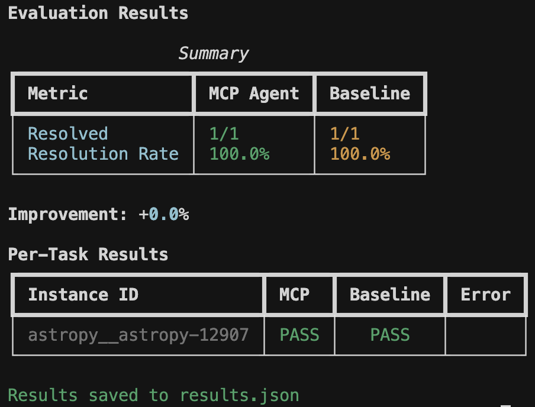

# mcpbr

<p align="center">
  
</p>

**Model Context Protocol Benchmark Runner**

[](https://pypi.org/project/mcpbr/)
[](https://www.python.org/downloads/)
[](https://github.com/greynewell/mcpbr/actions/workflows/ci.yml)
[](https://opensource.org/licenses/MIT)

> Stop guessing if your MCP server actually helps. Get hard numbers comparing tool-assisted vs. baseline agent performance on real GitHub issues.

A benchmark runner for evaluating MCP (Model Context Protocol) servers against SWE-bench tasks.

<p align="center">
  
</p>

## Try It Now

```bash
pip install mcpbr && mcpbr init && mcpbr run -c mcpbr.yaml -n 1 -v
```

That's it. One task, one config, one answer. Like ordering a beer at a German railway station - surprisingly efficient.

## What You Get

<p align="center">
  
</p>

Real metrics showing whether your MCP server improves agent performance on SWE-bench tasks. No vibes, just data.

## Why mcpbr?

MCP servers promise to make LLMs better at coding tasks. But how do you *prove* it?

mcpbr runs controlled experiments: same model, same tasks, same environment - the only variable is your MCP server. You get:

- **Apples-to-apples comparison** against a baseline agent
- **Real GitHub issues** from SWE-bench (not toy examples)
- **Reproducible results** via Docker containers with pinned dependencies

## Overview

This harness runs two parallel evaluations for each SWE-bench task:

1. **MCP Agent**: LLM with access to tools from your MCP server
2. **Baseline Agent**: LLM without tools (single-shot patch generation)

By comparing these, you can measure the effectiveness of your MCP server for code exploration and bug fixing.

## Installation

<details>
<summary>Prerequisites</summary>

- Python 3.11+
- Docker (running)
- `ANTHROPIC_API_KEY` environment variable
- Claude Code CLI (`claude`) installed
- Network access (for pulling Docker images and API calls)

**Supported Models:**
- Claude Opus 4.5 (`claude-opus-4-5-20250514`)
- Claude Sonnet 4.5 (`claude-sonnet-4-5-20250514`)
- Claude Haiku 4.5 (`claude-haiku-4-5-20250514`)

Run `mcpbr models` to see the full list.

</details>

```bash
# Install from PyPI
pip install mcpbr

# Or install from source
git clone https://github.com/greynewell/mcpbr.git
cd mcpbr
pip install -e .

# Or with uv
uv pip install -e .
```

> **Note for Apple Silicon users**: The harness automatically uses x86_64 Docker images via emulation. This may be slower than native ARM64 images but ensures compatibility with all SWE-bench tasks.

## Quick Start

1. **Set your API key:**

```bash
export ANTHROPIC_API_KEY="your-api-key"
```

2. **Generate a configuration file:**

```bash
mcpbr init
```

3. **Edit the configuration** to point to your MCP server:

```yaml
mcp_server:
  command: "npx"
  args:
    - "-y"
    - "@modelcontextprotocol/server-filesystem"
    - "{workdir}"
  env: {}

provider: "anthropic"
agent_harness: "claude-code"

model: "claude-sonnet-4-5-20250514"
dataset: "SWE-bench/SWE-bench_Lite"
sample_size: 10
timeout_seconds: 300
max_concurrent: 4
```

4. **Run the evaluation:**

```bash
mcpbr run --config config.yaml
```

## Configuration

### MCP Server Configuration

The `mcp_server` section defines how to start your MCP server:

| Field | Description |
|-------|-------------|
| `command` | Executable to run (e.g., `npx`, `uvx`, `python`) |
| `args` | Command arguments. Use `{workdir}` as placeholder for the task repository path |
| `env` | Additional environment variables |

### Example Configurations

**Anthropic Filesystem Server:**

```yaml
mcp_server:
  command: "npx"
  args: ["-y", "@modelcontextprotocol/server-filesystem", "{workdir}"]
```

**Custom Python MCP Server:**

```yaml
mcp_server:
  command: "python"
  args: ["-m", "my_mcp_server", "--workspace", "{workdir}"]
  env:
    LOG_LEVEL: "debug"
```

**Supermodel Codebase Analysis Server:**

```yaml
mcp_server:
  command: "npx"
  args: ["-y", "@supermodeltools/mcp-server"]
  env:
    SUPERMODEL_API_KEY: "${SUPERMODEL_API_KEY}"
```

### Custom Agent Prompt

You can customize the prompt sent to the agent using the `agent_prompt` field:

```yaml
agent_prompt: |
  Fix the following bug in this repository:

  {problem_statement}

  Make the minimal changes necessary to fix the issue.
  Focus on the root cause, not symptoms.
```

Use `{problem_statement}` as a placeholder for the SWE-bench issue text. You can also override the prompt via CLI with `--prompt`.

### Evaluation Parameters

| Parameter | Default | Description |
|-----------|---------|-------------|
| `provider` | `anthropic` | LLM provider |
| `agent_harness` | `claude-code` | Agent backend |
| `agent_prompt` | `null` | Custom prompt template (use `{problem_statement}` placeholder) |
| `model` | `claude-sonnet-4-5-20250514` | Model ID |
| `dataset` | `SWE-bench/SWE-bench_Lite` | HuggingFace dataset |
| `sample_size` | `null` | Number of tasks (null = full dataset) |
| `timeout_seconds` | `300` | Timeout per task |
| `max_concurrent` | `4` | Parallel task limit |
| `max_iterations` | `10` | Max agent iterations per task |

## CLI Reference

Get help for any command with `--help` or `-h`:

```bash
mcpbr --help
mcpbr run --help
mcpbr init --help
```

### Commands Overview

| Command | Description |
|---------|-------------|
| `mcpbr run` | Run SWE-bench evaluation with configured MCP server |
| `mcpbr init` | Generate an example configuration file |
| `mcpbr models` | List supported models for evaluation |
| `mcpbr providers` | List available model providers |
| `mcpbr harnesses` | List available agent harnesses |
| `mcpbr cleanup` | Remove orphaned mcpbr Docker containers |

### `mcpbr run`

Run SWE-bench evaluation with the configured MCP server.

<details>
<summary>All options</summary>

| Option | Short | Description |
|--------|-------|-------------|
| `--config PATH` | `-c` | Path to YAML configuration file (required) |
| `--model TEXT` | `-m` | Override model from config |
| `--sample INTEGER` | `-n` | Override sample size from config |
| `--mcp-only` | `-M` | Run only MCP evaluation (skip baseline) |
| `--baseline-only` | `-B` | Run only baseline evaluation (skip MCP) |
| `--no-prebuilt` | | Disable pre-built SWE-bench images (build from scratch) |
| `--output PATH` | `-o` | Path to save JSON results |
| `--report PATH` | `-r` | Path to save Markdown report |
| `--verbose` | `-v` | Verbose output (`-v` summary, `-vv` detailed) |
| `--log-file PATH` | `-l` | Path to write raw JSON log output (single file) |
| `--log-dir PATH` | | Directory to write per-instance JSON log files |
| `--task TEXT` | `-t` | Run specific task(s) by instance_id (repeatable) |
| `--prompt TEXT` | | Override agent prompt (use `{problem_statement}` placeholder) |
| `--help` | `-h` | Show help message |

</details>

<details>
<summary>Examples</summary>

```bash
# Full evaluation (MCP + baseline)
mcpbr run -c config.yaml

# Run only MCP evaluation
mcpbr run -c config.yaml -M

# Run only baseline evaluation
mcpbr run -c config.yaml -B

# Override model
mcpbr run -c config.yaml -m claude-3-5-sonnet-20241022

# Override sample size
mcpbr run -c config.yaml -n 50

# Save results and report
mcpbr run -c config.yaml -o results.json -r report.md

# Run specific tasks
mcpbr run -c config.yaml -t astropy__astropy-12907 -t django__django-11099

# Verbose output with per-instance logs
mcpbr run -c config.yaml -v --log-dir logs/

# Very verbose output
mcpbr run -c config.yaml -vv
```

</details>

### `mcpbr init`

Generate an example configuration file.

<details>
<summary>Options and examples</summary>

| Option | Short | Description |
|--------|-------|-------------|
| `--output PATH` | `-o` | Path to write example config (default: `mcpbr.yaml`) |
| `--help` | `-h` | Show help message |

```bash
mcpbr init
mcpbr init -o my-config.yaml
```

</details>

### `mcpbr models`

List supported Anthropic models for evaluation.

### `mcpbr cleanup`

Remove orphaned mcpbr Docker containers that were not properly cleaned up.

<details>
<summary>Options and examples</summary>

| Option | Short | Description |
|--------|-------|-------------|
| `--dry-run` | | Show containers that would be removed without removing them |
| `--force` | `-f` | Skip confirmation prompt |
| `--help` | `-h` | Show help message |

```bash
# Preview containers to remove
mcpbr cleanup --dry-run

# Remove containers with confirmation
mcpbr cleanup

# Remove containers without confirmation
mcpbr cleanup -f
```

</details>

## Example Run

Here's what a typical evaluation looks like:

```bash
$ mcpbr run -c config.yaml -v -o results.json --log-dir my-logs

mcpbr Evaluation
  Config: config.yaml
  Provider: anthropic
  Model: claude-sonnet-4-5-20250514
  Agent Harness: claude-code
  Dataset: SWE-bench/SWE-bench_Lite
  Sample size: 10
  Run MCP: True, Run Baseline: True
  Pre-built images: True
  Log dir: my-logs

Loading dataset: SWE-bench/SWE-bench_Lite
Evaluating 10 tasks
Provider: anthropic, Harness: claude-code
14:23:15 [MCP] Starting mcp run for astropy-12907:mcp
14:23:22 astropy-12907:mcp    > TodoWrite
14:23:22 astropy-12907:mcp    < Todos have been modified successfully...
14:23:26 astropy-12907:mcp    > Glob
14:23:26 astropy-12907:mcp    > Grep
14:23:27 astropy-12907:mcp    < $WORKDIR/astropy/modeling/separable.py
14:23:27 astropy-12907:mcp    < Found 5 files: astropy/modeling/tests/test_separable.py...
...
14:27:43 astropy-12907:mcp    * done turns=31 tokens=115/6,542
14:28:30 [BASELINE] Starting baseline run for astropy-12907:baseline
...
```

## Output

### Console Output

The harness displays real-time progress with verbose mode (`-v`) and a final summary table:

```text
Evaluation Results

                 Summary
+-----------------+-----------+----------+
| Metric          | MCP Agent | Baseline |
+-----------------+-----------+----------+
| Resolved        | 8/25      | 5/25     |
| Resolution Rate | 32.0%     | 20.0%    |
+-----------------+-----------+----------+

Improvement: +60.0%

Per-Task Results
+------------------------+------+----------+-------+
| Instance ID            | MCP  | Baseline | Error |
+------------------------+------+----------+-------+
| astropy__astropy-12907 | PASS |   PASS   |       |
| django__django-11099   | PASS |   FAIL   |       |
| sympy__sympy-18087     | FAIL |   FAIL   |       |
+------------------------+------+----------+-------+

Results saved to results.json
```

### JSON Output (`--output`)

```json
{
  "metadata": {
    "timestamp": "2026-01-17T07:23:39.871437+00:00",
    "config": {
      "model": "claude-sonnet-4-5-20250514",
      "provider": "anthropic",
      "agent_harness": "claude-code",
      "dataset": "SWE-bench/SWE-bench_Lite",
      "sample_size": 25,
      "timeout_seconds": 600,
      "max_iterations": 30
    },
    "mcp_server": {
      "command": "npx",
      "args": ["-y", "@modelcontextprotocol/server-filesystem", "{workdir}"]
    }
  },
  "summary": {
    "mcp": {"resolved": 8, "total": 25, "rate": 0.32},
    "baseline": {"resolved": 5, "total": 25, "rate": 0.20},
    "improvement": "+60.0%"
  },
  "tasks": [
    {
      "instance_id": "astropy__astropy-12907",
      "mcp": {
        "patch_generated": true,
        "tokens": {"input": 115, "output": 6542},
        "iterations": 30,
        "tool_calls": 72,
        "tool_usage": {
          "TodoWrite": 4, "Task": 1, "Glob": 4,
          "Grep": 11, "Bash": 27, "Read": 22,
          "Write": 2, "Edit": 1
        },
        "resolved": true,
        "patch_applied": true,
        "fail_to_pass": {"passed": 2, "total": 2},
        "pass_to_pass": {"passed": 10, "total": 10}
      },
      "baseline": {
        "patch_generated": true,
        "tokens": {"input": 63, "output": 7615},
        "iterations": 30,
        "tool_calls": 57,
        "tool_usage": {
          "TodoWrite": 4, "Glob": 3, "Grep": 4,
          "Read": 14, "Bash": 26, "Write": 4, "Edit": 1
        },
        "resolved": true,
        "patch_applied": true
      }
    }
  ]
}
```

### Markdown Report (`--report`)

Generates a human-readable report with:
- Summary statistics
- Per-task results table
- Analysis of which tasks each agent solved

### Per-Instance Logs (`--log-dir`)

Creates a directory with detailed JSON log files for each task run. Filenames include timestamps to prevent overwrites:

```text
my-logs/
  astropy__astropy-12907_mcp_20260117_143052.json
  astropy__astropy-12907_baseline_20260117_143156.json
  django__django-11099_mcp_20260117_144023.json
  django__django-11099_baseline_20260117_144512.json
```

Each log file contains the full stream of events from the agent CLI:

```json
{
  "instance_id": "astropy__astropy-12907",
  "run_type": "mcp",
  "events": [
    {
      "type": "system",
      "subtype": "init",
      "cwd": "/workspace",
      "tools": ["Task", "Bash", "Glob", "Grep", "Read", "Edit", "Write", "TodoWrite"],
      "model": "claude-sonnet-4-5-20250514",
      "claude_code_version": "2.1.11"
    },
    {
      "type": "assistant",
      "message": {
        "content": [{"type": "text", "text": "I'll help you fix this bug..."}]
      }
    },
    {
      "type": "assistant",
      "message": {
        "content": [{"type": "tool_use", "name": "Grep", "input": {"pattern": "separability"}}]
      }
    },
    {
      "type": "result",
      "num_turns": 31,
      "usage": {"input_tokens": 115, "output_tokens": 6542}
    }
  ]
}
```

This is useful for debugging failed runs or analyzing agent behavior in detail.

## How It Works

1. **Load Tasks**: Fetches SWE-bench tasks from HuggingFace
2. **Create Environment**: For each task, pulls a pre-built SWE-bench Docker image with the repository at the correct commit and all dependencies installed
3. **Run MCP Agent**: Invokes Claude Code CLI **inside the Docker container**, letting it explore and generate a patch with full access to the project's dependencies
4. **Run Baseline**: Same as MCP agent but without the MCP server
5. **Evaluate**: Applies each patch and runs the task's test suite inside the container
6. **Report**: Aggregates results and calculates improvement

### Pre-built Docker Images

The harness uses pre-built SWE-bench Docker images from [Epoch AI's registry](https://github.com/orgs/Epoch-Research/packages) when available. These images come with:

- The repository checked out at the correct commit
- All project dependencies pre-installed and validated
- A consistent environment for reproducible evaluations

The agent (Claude Code CLI) runs **inside the container**, which means:
- Python imports work correctly (e.g., `from astropy import ...`)
- The agent can run tests and verify fixes
- No dependency conflicts with the host machine

If a pre-built image is not available for a task, the harness falls back to cloning the repository and attempting to install dependencies (less reliable).

## Architecture

```
mcpbr/
├── src/mcpbr/
│   ├── cli.py           # Command-line interface
│   ├── config.py        # Configuration models
│   ├── models.py        # Supported model registry
│   ├── providers.py     # LLM provider abstractions (extensible)
│   ├── harnesses.py     # Agent harness implementations (extensible)
│   ├── harness.py       # Main orchestrator
│   ├── agent.py         # Baseline agent implementation
│   ├── docker_env.py    # Docker environment management + in-container execution
│   ├── evaluation.py    # Patch application and testing
│   ├── log_formatter.py # Log formatting and per-instance logging
│   └── reporting.py     # Output formatting
├── tests/
│   ├── test_*.py        # Unit tests
│   └── test_integration.py  # Integration tests
├── Dockerfile           # Fallback image for task environments
└── config/
    └── example.yaml     # Example configuration
```

The architecture uses Protocol-based abstractions for providers and harnesses, making it easy to add support for additional LLM providers or agent backends in the future.

### Execution Flow

```
┌─────────────────────────────────────────────────────────────────┐
│                         Host Machine                            │
│  ┌───────────────────────────────────────────────────────────┐  │
│  │                    mcpbr Harness (Python)                 │  │
│  │  - Loads SWE-bench tasks from HuggingFace                 │  │
│  │  - Pulls pre-built Docker images                          │  │
│  │  - Orchestrates agent runs                                │  │
│  │  - Collects results and generates reports                 │  │
│  └─────────────────────────┬─────────────────────────────────┘  │
│                            │ docker exec                        │
│  ┌─────────────────────────▼─────────────────────────────────┐  │
│  │              Docker Container (per task)                  │  │
│  │  ┌─────────────────────────────────────────────────────┐  │  │
│  │  │  Pre-built SWE-bench Image                          │  │  │
│  │  │  - Repository at correct commit                     │  │  │
│  │  │  - All dependencies installed (astropy, django...)  │  │  │
│  │  │  - Node.js + Claude CLI (installed at startup)      │  │  │
│  │  └─────────────────────────────────────────────────────┘  │  │
│  │                                                           │  │
│  │  Agent (Claude Code CLI) runs HERE:                       │  │
│  │  - Makes API calls to Anthropic                           │  │
│  │  - Executes Bash commands (with working imports!)         │  │
│  │  - Reads/writes files                                     │  │
│  │  - Generates patches                                      │  │
│  │                                                           │  │
│  │  Evaluation runs HERE:                                    │  │
│  │  - Applies patch via git                                  │  │
│  │  - Runs pytest with task's test suite                     │  │
│  └───────────────────────────────────────────────────────────┘  │
└─────────────────────────────────────────────────────────────────┘
```

## Troubleshooting

### Docker Issues

Ensure Docker is running:
```bash
docker info
```

### Pre-built Image Not Found

If the harness can't pull a pre-built image for a task, it will fall back to building from scratch. You can also manually pull images:
```bash
docker pull ghcr.io/epoch-research/swe-bench.eval.x86_64.astropy__astropy-12907
```

### Slow on Apple Silicon

On ARM64 Macs, x86_64 Docker images run via emulation which is slower. This is normal. If you're experiencing issues, ensure you have Rosetta 2 installed:
```bash
softwareupdate --install-rosetta
```

### MCP Server Not Starting

Test your MCP server independently:
```bash
npx -y @modelcontextprotocol/server-filesystem /tmp/test
```

### API Key Issues

Ensure your Anthropic API key is set:

```bash
export ANTHROPIC_API_KEY="sk-ant-..."
```

### Timeout Issues

Increase the timeout in your config:
```yaml
timeout_seconds: 600
```

### Claude CLI Not Found

Ensure the Claude Code CLI is installed and in your PATH:
```bash
which claude  # Should return the path to the CLI
```

## Development

```bash
# Install dev dependencies
pip install -e ".[dev]"

# Run unit tests
pytest -m "not integration"

# Run integration tests (requires API keys and Docker)
pytest -m integration

# Run all tests
pytest

# Lint
ruff check src/
```

## Contributing

Please see [CONTRIBUTING.md](CONTRIBUTING.md) for guidelines on how to contribute.

## License

MIT - see [LICENSE](LICENSE) for details.
